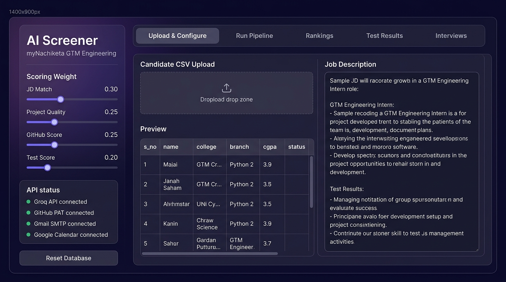
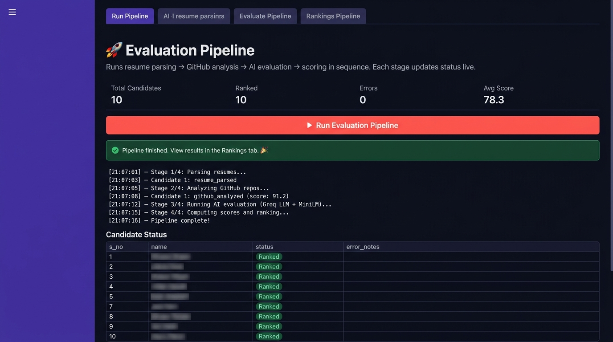
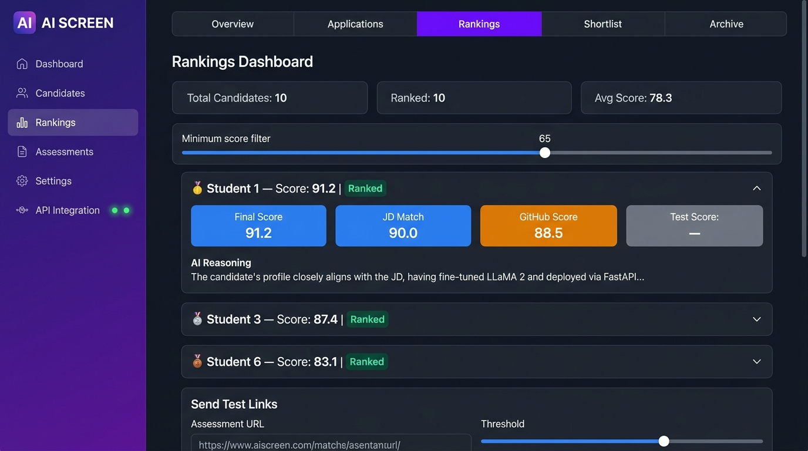
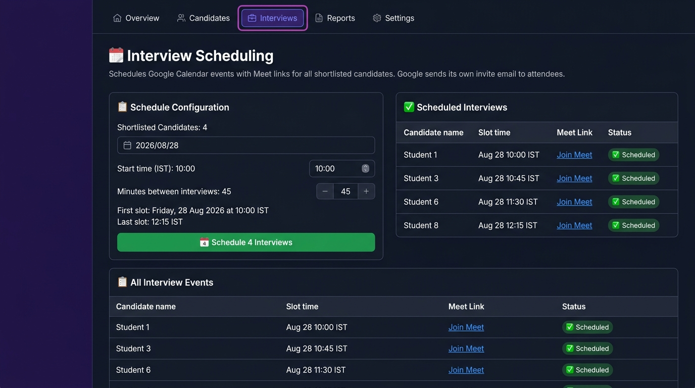

# 🎯 AI-Powered Candidate Screening Platform
### myNachiketa GTM Engineering Intern Assignment

[](https://python.org)
[](https://streamlit.io)
[](https://groq.com)
[](https://docs.github.com/en/rest)
[](LICENSE)
[](README.md)

> A fully automated, end-to-end AI recruiter pipeline. Upload a candidate CSV → paste a JD → click one button. The platform parses resumes, analyzes GitHub repos via REST API, evaluates candidates using an LLM, scores them with a Weighted Sum Model, sends test-link emails, re-ranks after test results, and auto-schedules Google Calendar interviews with Meet links. **Total infrastructure cost: $0.**

---

## 📸 App Screenshots

<table>
  <tr>
    <td align="center"><b>Tab 1 — Upload & Configure</b></td>
    <td align="center"><b>Tab 2 — Evaluation Pipeline</b></td>
  </tr>
  <tr>
    <td></td>
    <td></td>
  </tr>
  <tr>
    <td align="center"><b>Tab 3 — AI Rankings Dashboard</b></td>
    <td align="center"><b>Tab 5 — Interview Scheduling</b></td>
  </tr>
  <tr>
    <td></td>
    <td></td>
  </tr>
</table>

---

## 🚀 Full Pipeline

```
Upload CSV → Parse Resumes (PDF) → GitHub Analysis → AI Evaluation
    → Score & Rank → Send Test Links → Upload Results → Re-rank
    → Mark Shortlist → Auto-Schedule Google Calendar Interviews
```

Every stage is **automatic** once triggered. The recruiter clicks buttons — no manual work.

---

## ✨ Feature Overview

| Stage | Technology | What Happens |
|---|---|---|
| **CSV Ingestion** | `pandas` + SQLite | Normalize column aliases, dedup on `s_no`, persist to DB |
| **Resume Parsing** | `pdfplumber` + PyMuPDF | Download PDF from Google Drive, dual-extractor fallback |
| **GitHub Analysis** | GitHub REST API v3 | Per-repo WSM: activity, commits (6mo), README quality, originality |
| **AI Evaluation** | MiniLM-L6-v2 + Groq LLM | Cosine sim + structured JSON scoring with reasoning |
| **WSM Scoring** | MCDA / Weighted Sum | Auto-renormalization when signals are missing (no GitHub, no test) |
| **Send Test Links** | Gmail SMTP | Branded HTML email with `name + s_no` in subject for tracking |
| **Test Results** | SQLite JOIN on `s_no` | Merge scores, re-run full WSM with all 4 signals active |
| **Interview Scheduling** | Google Calendar API | Creates events, generates Meet links, Google sends own invite |

---

## 🏗️ Architecture

### High-Level System Design

```
┌─────────────────────────── Streamlit App (single-process) ─────────────────────────────┐
│                                                                                          │
│  ┌──── UI Layer (5 Tabs) ─────────────────────────────────────────────────────────────┐ │
│  │  Tab 1: Upload CSV + paste JD                                                       │ │
│  │  Tab 2: Run Pipeline (live status log, 4-stage progress)                            │ │
│  │  Tab 3: Rankings (score cards, AI reasoning, GitHub breakdown, send test links)     │ │
│  │  Tab 4: Upload test_results.csv → merge → re-rank → mark shortlist                 │ │
│  │  Tab 5: Schedule Google Calendar interviews with Meet links                         │ │
│  └─────────────────────────────────────────────────────────────────────────────────────┘ │
│                                                                                          │
│  ┌──── modules/ ──────────────────────────────────────────────────────────────────────┐ │
│  │  resume_parser.py     Drive URL → bytes → pdfplumber → PyMuPDF fallback            │ │
│  │  github_analyzer.py   REST API → per-repo metrics → WSM sub-score                  │ │
│  │  ai_evaluator.py      MiniLM (cosine sim) + Groq LLM (JSON reasoning)              │ │
│  │  scorer.py            WSM final_score + renorm + RANK()                            │ │
│  │  emailer.py           smtplib → Gmail SMTP → branded HTML email                    │ │
│  │  calendar_scheduler.py  Google Calendar API → event + Meet + invite                │ │
│  └─────────────────────────────────────────────────────────────────────────────────────┘ │
│                                                                                          │
│  db.py ──► SQLite file (candidates + scores + interview_events tables)                   │
└──────────────────────────────────────────────────────────────────────────────────────────┘
         ↑ free              ↑ free/5000rph     ↑ local          ↑ free tier
   Streamlit Cloud       GitHub REST API    HF MiniLM-L6-v2   Groq Compound
```

### Data Flow

```
candidates.csv
    │
    ├─ normalize_csv_columns()       ← alias "github"→"github_url", "resume"→"resume_url"
    ├─ insert_candidates(df)         ← dedup on s_no (NOT email)
    │
    ▼  status: uploaded
resume_parser.py
    ├─ drive_to_direct_url()         ← extract file ID, build uc?export=download URL
    ├─ download_pdf()                ← requests with Drive virus-scan confirm handling
    ├─ extract_text_pdfplumber()     ← primary extractor
    └─ extract_text_pymupdf()        ← fallback for scanned/image PDFs
    │
    ▼  status: resume_parsed | resume_failed
github_analyzer.py
    ├─ GET /users/{username}/repos   ← paginated, all public repos
    ├─ GET /repos/{owner}/{repo}/commits?since=6mo
    └─ WSM sub-score:
         activity_recency   (0.35)
         commit_frequency   (0.25)
         original_ratio     (0.20)
         docs_quality       (0.20)
    │
    ▼  status: github_analyzed | github_failed
ai_evaluator.py
    ├─ MiniLM-L6-v2 (local)         ← embed JD + candidate text → cosine similarity
    ├─ Groq compound (API)           ← structured JSON: jd_match, project_quality, reasoning
    └─ fallback: embedding_sim used as jd_match proxy if Groq fails
    │
    ▼  status: ai_scored
scorer.py
    ├─ get_active_weights()          ← zeros w3/w4 if missing, renorm to 1.0
    ├─ final_score = Σ(wᵢ × scoreᵢ)
    └─ RANK() by final_score DESC
    │
    ▼  status: ranked
emailer.py  →  Gmail SMTP HTML email  →  subject: "Assessment — {name} (s_no {n})"
    │
    ▼  status: test_sent
test_results.csv (JOIN on s_no)
    └─ test_score = (test_la + test_code) / 2  →  re-rank with 4 signals
    │
    ▼  status: shortlisted
calendar_scheduler.py
    └─ events.insert() + conferenceData  ← Meet link auto-created
    └─ Google sends invite email to attendee
    │
    ▼  status: interview_scheduled
```

### Database Schema

```sql
-- Primary key is s_no (unique number), NOT email
-- Multiple candidates can share the same email (recruiter forwarding inbox)

CREATE TABLE candidates (
    s_no            INTEGER PRIMARY KEY,
    name            TEXT    NOT NULL,
    email           TEXT,
    college         TEXT,
    branch          TEXT,
    cgpa            REAL,
    best_ai_project TEXT,
    research_work   TEXT,
    github_url      TEXT,       -- NULL = score renormalized automatically
    resume_url      TEXT,       -- Google Drive sharing link
    resume_text     TEXT,       -- extracted by pdfplumber/PyMuPDF
    status          TEXT DEFAULT 'uploaded',
    error_notes     TEXT,
    created_at      TEXT
);

CREATE TABLE scores (
    s_no            INTEGER PRIMARY KEY REFERENCES candidates(s_no),
    embedding_sim   REAL,   -- MiniLM cosine similarity ×100 (0–100)
    jd_match        REAL,   -- Groq LLM score (0–100)
    project_quality REAL,   -- Groq LLM score (0–100)
    github_score    REAL,   -- GitHub WSM sub-score (0–100), NULL if no URL
    test_la         REAL,
    test_code       REAL,
    test_score      REAL,   -- (test_la + test_code) / 2
    final_score     REAL,   -- WSM weighted sum
    rank            INTEGER,
    llm_reasoning   TEXT,
    github_breakdown TEXT   -- JSON: per-repo stats + sub-scores
);

CREATE TABLE interview_events (
    s_no              INTEGER PRIMARY KEY REFERENCES candidates(s_no),
    calendar_event_id TEXT,
    meet_link         TEXT,
    scheduled_time    TEXT,
    invite_sent       INTEGER DEFAULT 0
);
```

---

## 🧠 Scoring Methodology

### Why Weighted Sum Model (MCDA)?

1. **No historical labels exist** — no "hired/performed well" data to train a classifier. SHAP/LIME don't apply here.
2. **Direct brief alignment** — the 4 WSM terms map 1:1 to the stated criteria: Resume, GitHub, JD relevance, Test performance.
3. **Maximum auditability** — every sub-score, weight, and LLM reasoning string is stored and displayed in the dashboard.

### Formula

```
final_score = w1 × jd_match + w2 × project_quality + w3 × github_score + w4 × test_score
```

| Weight | Default | Signal |
|---|---|---|
| w1 | 0.30 | JD Match (MiniLM + Groq) |
| w2 | 0.25 | Project Quality (Groq) |
| w3 | 0.25 | GitHub Score (REST API WSM) |
| w4 | 0.20 | Test Score (uploaded CSV) |

### Missing-Signal Renormalization

```python
def get_active_weights(weights, has_test, has_github):
    active = dict(weights)
    if not has_test:   active['w4'] = 0
    if not has_github: active['w3'] = 0
    remaining = sum(active.values())
    return {k: v/remaining if remaining > 0 else 0 for k, v in active.items()}
```

---

## 📁 Project Structure

```
candidate-screening-platform/
├── app.py                           # Main Streamlit app (5 tabs)
├── db.py                            # SQLite schema + CRUD + CSV normalization
├── modules/
│   ├── resume_parser.py             # Drive PDF download + dual extractor
│   ├── github_analyzer.py           # GitHub REST API + WSM sub-scorer
│   ├── ai_evaluator.py              # MiniLM + Groq LLM evaluator
│   ├── scorer.py                    # WSM final scorer + renormalization
│   ├── emailer.py                   # Gmail SMTP HTML mailer
│   └── calendar_scheduler.py        # Google Calendar + Meet scheduler
├── sample_data/
│   ├── candidates.csv               # 10-row demo CSV
│   └── test_results.csv             # Demo test scores
├── docs/screenshots/                # UI screenshots (embedded above)
├── .streamlit/
│   ├── secrets.toml.example         # Template
│   └── secrets.toml                 # ← git-ignored (NEVER committed)
├── requirements.txt
├── README.md
└── USER_GUIDE.md                    # Step-by-step recruiter guide
```

---

## ⚙️ Local Setup

```bash
git clone https://github.com/dummycodertech/mynachiketa_assessment.git
cd mynachiketa_assessment
pip install -r requirements.txt
cp .streamlit/secrets.toml.example .streamlit/secrets.toml
# Fill in your API keys in secrets.toml
streamlit run app.py
```

### Required API Keys

| Key | Source |
|---|---|
| `GROQ_API_KEY` | [console.groq.com](https://console.groq.com) → API Keys |
| `GITHUB_PAT` | [github.com/settings/tokens](https://github.com/settings/tokens) → Classic, `public_repo` |
| `GMAIL_APP_PASSWORD` | [myaccount.google.com/apppasswords](https://myaccount.google.com/apppasswords) |
| `GOOGLE_OAUTH_CLIENT_JSON` | Google Cloud Console → OAuth 2.0 → Desktop app → base64-encode token |

Full setup instructions: **[USER_GUIDE.md](USER_GUIDE.md)**

---

## ☁️ Deploy to Streamlit Community Cloud

1. Push repo to GitHub
2. [share.streamlit.io](https://share.streamlit.io) → New app → select repo → `app.py`
3. **Advanced settings → Secrets**: paste full `secrets.toml` contents
4. Deploy → get free public URL

---

## 💰 Total Cost: $0/month

Streamlit Cloud + GitHub REST API (free tier) + HuggingFace MiniLM (local) + Groq free tier + Gmail SMTP + Google Calendar personal OAuth = **$0**.

---

## 📄 License

MIT — free to use, modify, and distribute.

*Built for the myNachiketa GTM Engineering Intern Assignment*
