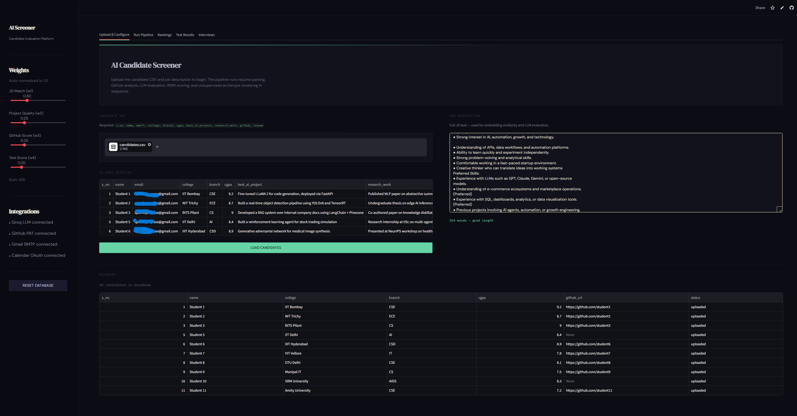
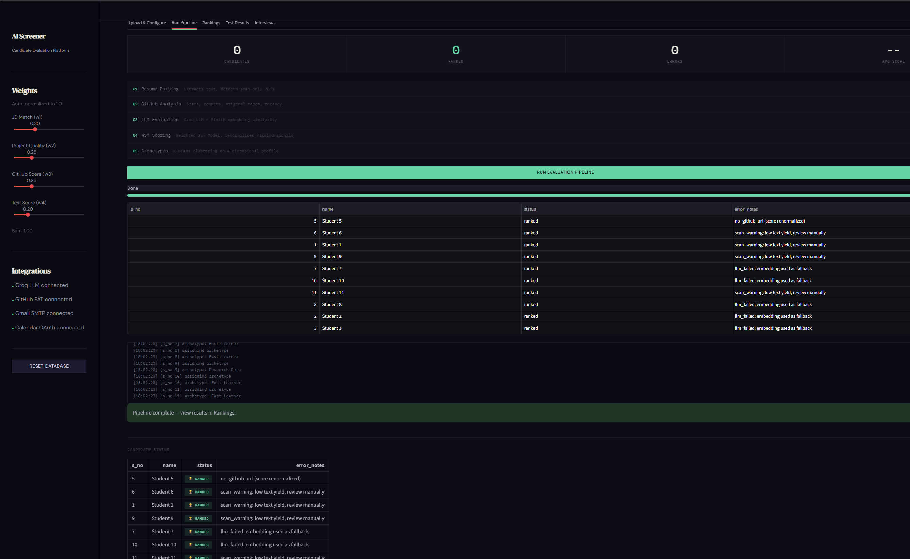
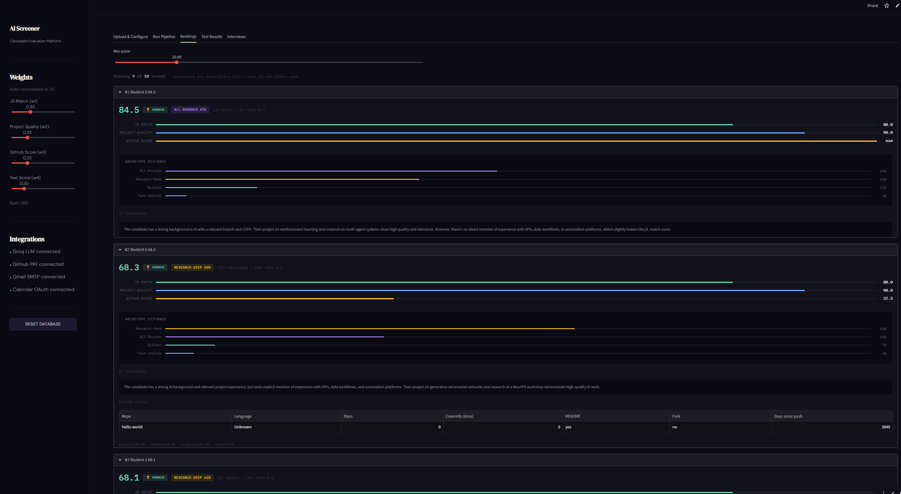
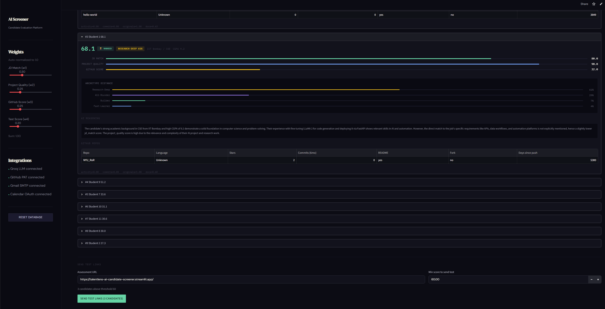
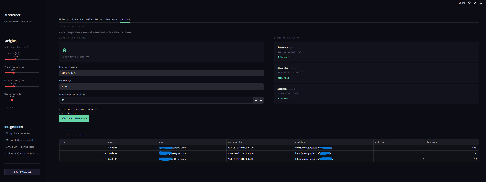
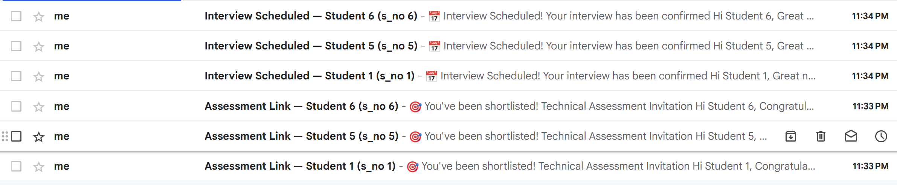
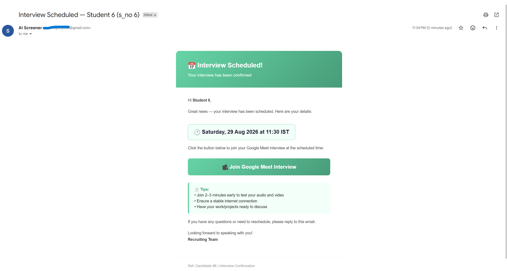
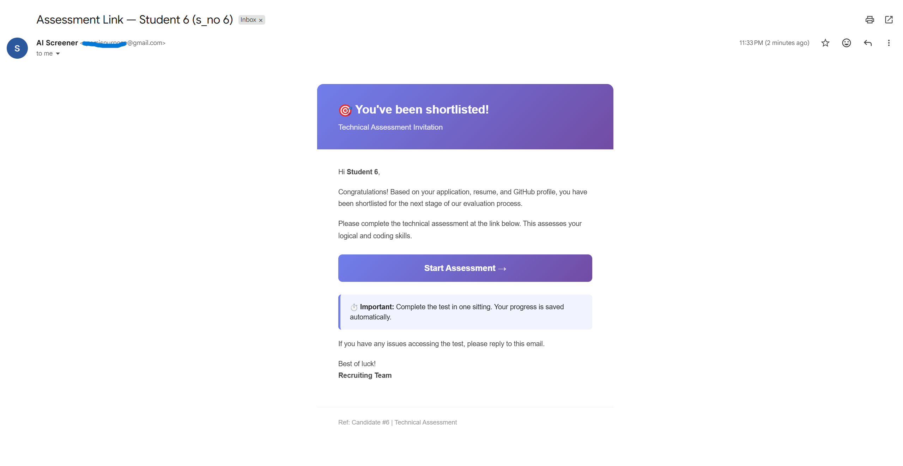
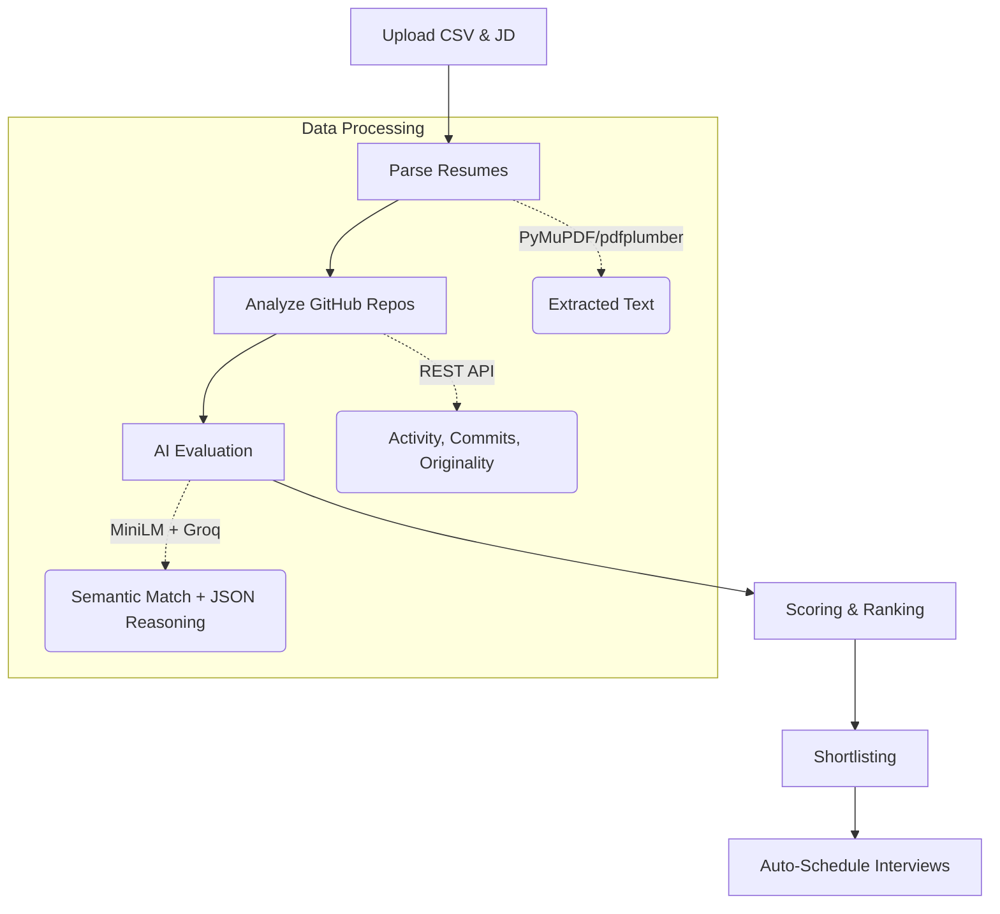

<div align="center">

# 🎯 TalentLens: AI-Powered Candidate Screening Platform

**An end-to-end, zero-cost, fully automated recruiter pipeline for AI/ML engineering candidates.**

[](https://talentlens-ai-candidate-screener.streamlit.app/)
[](https://python.org)
[](https://groq.com)
[](LICENSE)

*Built as a showcase for seamless automation, explainable AI, and intelligent decision-making.*

</div>

---

## 🌟 Project Overview

**TalentLens** is a sophisticated, fully-automated hiring pipeline designed to evaluate engineering candidates accurately, fairly, and transparently. In today's competitive job market, recruiters are overwhelmed with applications. TalentLens solves this by automatically parsing resumes, analyzing GitHub repositories, evaluating candidate skills using LLMs, and even scheduling Google Calendar interviews. 

### Why is this impressive?
- **Zero Infrastructure Cost:** Every component (Hosting, DB, LLMs, APIs) runs on a free tier or locally.
- **Explainable AI:** Uses a Weighted Sum Model (WSM) and Multi-Criteria Decision Analysis (MCDA) so recruiters can see *exactly* why a candidate scored what they did—no black boxes.
- **End-to-End Automation:** From CSV upload to an automatically generated Google Meet invite, the recruiter just clicks buttons while the pipeline does the heavy lifting.

---

## 📸 Platform Walkthrough & Features

Explore the capabilities of TalentLens through our intuitive UI.

### 1. Upload & Configure
Recruiters can seamlessly upload candidate data and the target Job Description (JD).
<p align="center">
  
</p>

### 2. Live Pipeline Execution
The system provides real-time feedback as it parses resumes, calls GitHub APIs, and queries the LLM for every candidate.
<p align="center">
  
</p>
<p align="center">
  
</p>

### 3. Deep-Dive Rankings Dashboard
Candidates are ranked using our robust scoring algorithm. The dashboard provides an explainable breakdown of *why* they received their score, including LLM reasoning and GitHub metrics.
<p align="center">
  
</p>
<p align="center">
  
</p>

### 4. Custom Candidate Archetypes
Using unsupervised K-Means clustering, the platform automatically groups candidates into distinct profiles (e.g., *Builder*, *Research-Deep*, *All-Rounder*) to help recruiters balance team composition.
<p align="center">
  
</p>

### 5. Seamless Interview Scheduling
Once a candidate is shortlisted, the platform integrates directly with Google Calendar to generate a Google Meet link and send a personalized invite—all with a single click.
<p align="center">
  
</p>
<p align="center">
  
</p>

---

## 🏗️ How It Works (Technical Architecture)



### Core Technologies
| Component | Technology Used | Purpose |
|-----------|-----------------|---------|
| **Frontend UI** | Streamlit | Rapid, single-app interface development |
| **Database** | SQLite | Lightweight, zero-setup relational data storage |
| **Resume Parsing** | pdfplumber, PyMuPDF | Downloads from G-Drive & extracts text from PDFs |
| **GitHub Analysis** | GitHub REST API | Per-repo scoring (activity, commits, documentation) |
| **Embeddings** | HF MiniLM-L6-v2 | Local semantic similarity (cosine sim) for JD matching |
| **LLM Reasoning** | Groq (Llama 3.3 70B) | Generates structured JSON feedback on project quality |
| **Email/Calendar** | Google OAuth, SMTP | Sends automated branded emails & Google Meet invites |

---

## 🧠 The Brains: Scoring Methodology (MCDA)

Instead of relying on a black-box machine learning model (which would require non-existent historical training data), TalentLens employs a **Weighted Sum Model (WSM)**, the simplest form of **Multi-Criteria Decision Analysis (MCDA)**.

The scoring formula perfectly maps to four key dimensions:
1. **`jd_match`** (30%): Semantic relevance via MiniLM + Groq LLM.
2. **`project_quality`** (25%): LLM evaluation of resume project depth and complexity.
3. **`github_score`** (25%): REST API sub-formula analyzing recency, commit frequency, and documentation.
4. **`test_score`** (20%): Standardized logical/coding test scores.

**Dynamic Re-weighting:** If a candidate lacks a GitHub URL or test score, the system dynamically redistributes the weight to the remaining criteria to ensure fairness without penalizing the candidate.

---

## 🛠️ Quick Start Guide for Developers

Want to run this locally? Follow these steps:

### 1. Clone & Install
```bash
git clone https://github.com/dummycodertech/mynachiketa_assessment.git
cd mynachiketa_assessment
pip install -r requirements.txt
```

### 2. Configure Environment Secrets
Create the `.streamlit/secrets.toml` file from the example template:
```bash
cp .streamlit/secrets.toml.example .streamlit/secrets.toml
```

**Required Keys:**
- `GROQ_API_KEY`: Get from [Groq Console](https://console.groq.com)
- `GITHUB_PAT`: Classic token with `public_repo` access
- `GMAIL_ADDRESS` & `GMAIL_APP_PASSWORD`
- `GOOGLE_OAUTH_CLIENT_JSON` (for Calendar API)

### 3. Launch the App
```bash
streamlit run app.py
```

---

## 🚀 Future Scalability (Path to Production)

While built as a robust zero-cost prototype, the architecture is designed for easy enterprise scaling:
- **Database:** Migrate from SQLite to **Supabase (PostgreSQL)**.
- **Asynchronous Processing:** Replace synchronous execution with **Celery + Redis**.
- **LLM Engine:** Easily swap Groq for enterprise **OpenAI GPT-4o** or **Anthropic Claude 3.5**.
- **Auth:** Implement **Clerk** or Supabase Auth for multi-recruiter RBAC.

---
*Developed with ❤️ to showcase the intersection of Data Engineering, AI, and Product Design.*
